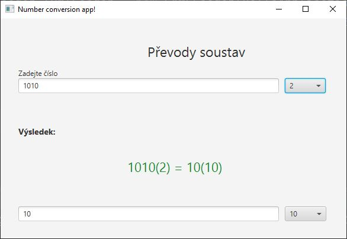

# Lesson 07  - Samostatná práce

Vytvořte aplikaci pro která převede libovolné kladné číslo mezli následujícími číselnými soutavami, případně vypíše chybovou hlášku pokud uživatel zadá neplané číslo, nebo text.
- 2
- 10
- 8
- 16

